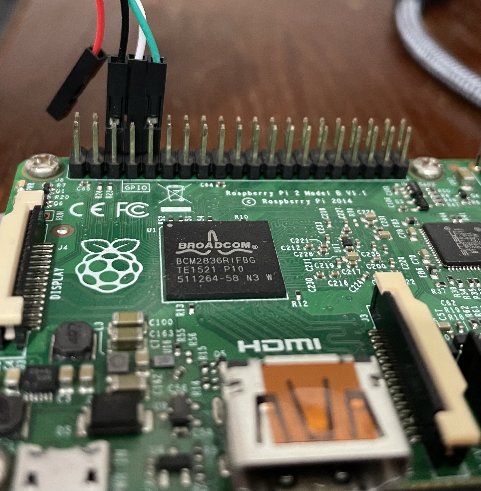

# raspberry-pi-2-baremetal

This repository contains environment for building a bare-metal executable which runs on Raspberry Pi 2 B Arm core.
Execution can be emulated using QEMU.

## Build

Install Arm cross-compiler:
```
sudo apt install gcc-arm-none-eabi
```
Image is built using `make all`.


## QEMU

Install QEMU for ARM:
```
sudo apt install qemu-system-arm
```

*qemu* directory contains necessary files to run output image on QEMU.
`make qemu` can be used to build and run the image. Use *ctrl+a*, *x* to quit QEMU.


## RPi Hardware

An SD card is required to run on actual hardware, and its first partition has to be FAT32 (this is created by default using the [Raspberry Pi Imager](https://www.raspberrypi.com/software)).

At a minimum, the FAT32 partition has to include these files:
- **bootcode.bin** - first executed software
- **fixup.dat** - required for RAM initialization
- **start.elf** - reads *config.txt* (if present) and executes the *kernel* (*kernel7.img* by default)
- **config.txt** - optional, includes configuration parameters for startup
- ***kernel image***

Note that since first 4 steps involve running on the GPU (VPU / VideoCore IV), this sequence cannot be easily modified. The built ***kernel image*** is the first software to execute on the Arm core and so it is the starting point for out bare-metal image, which replaces the default kernel.

`make sd` can be used to copy required files to *sd* directory.


### Serial Connection

Serial connection can be used via GPIO pins:

- **6** GND
- **8** TX
- **10** RX



Terminal connection via *Putty* can be opened by running `make putty`, assuming */dev/ttyUSB0* as serial device.

Example printout:

```
Raspberry Pi Bootcode
Read File: config.txt, 179
Read File: start.elf, 2979296 (bytes)
Read File: fixup.dat, 7277 (bytes)
MESS:00:00:00.928803:0: brfs: File read: /mfs/sd/config.txt
MESS:00:00:00.932944:0: brfs: File read: 179 bytes
MESS:00:00:00.975446:0: HDMI0:EDID error reading EDID block 0 attempt 0
MESS:00:00:00.981614:0: HDMI0:EDID error reading EDID block 0 attempt 1
MESS:00:00:00.987949:0: HDMI0:EDID error reading EDID block 0 attempt 2
MESS:00:00:00.994286:0: HDMI0:EDID error reading EDID block 0 attempt 3
MESS:00:00:01.000623:0: HDMI0:EDID error reading EDID block 0 attempt 4
MESS:00:00:01.006960:0: HDMI0:EDID error reading EDID block 0 attempt 5
MESS:00:00:01.013298:0: HDMI0:EDID error reading EDID block 0 attempt 6
MESS:00:00:01.019633:0: HDMI0:EDID error reading EDID block 0 attempt 7
MESS:00:00:01.025970:0: HDMI0:EDID error reading EDID block 0 attempt 8
MESS:00:00:01.032308:0: HDMI0:EDID error reading EDID block 0 attempt 9
MESS:00:00:01.038402:0: HDMI0:EDID giving up on reading EDID block 0
MESS:00:00:01.051936:0: brfs: File read: /mfs/sd/config.txt
MESS:00:00:01.056136:0: gpioman: gpioman_get_pin_num: pin LEDS_PWR_OK not defined
MESS:00:00:01.076851:0: gpioman: gpioman_get_pin_num: pin WL_LPO_CLK not defined
MESS:00:00:01.082560:0: gpioman: gpioman_get_pin_num: pin BT_ON not defined
MESS:00:00:01.089239:0: gpioman: gpioman_get_pin_num: pin WL_ON not defined
MESS:00:00:01.270657:0: gpioman: gpioman_get_pin_num: pin DISPLAY_DSI_PORT not defined
MESS:00:00:01.277847:0: gpioman: gpioman_get_pin_num: pin LEDS_PWR_OK not defined
MESS:00:00:01.284125:0: *** Restart logging
MESS:00:00:01.287998:0: brfs: File read: 179 bytes
MESS:00:00:01.299582:0: hdmi: HDMI0:EDID error reading EDID block 0 attempt 0
MESS:00:00:01.306274:0: hdmi: HDMI0:EDID error reading EDID block 0 attempt 1
MESS:00:00:01.313131:0: hdmi: HDMI0:EDID error reading EDID block 0 attempt 2
MESS:00:00:01.319989:0: hdmi: HDMI0:EDID error reading EDID block 0 attempt 3
MESS:00:00:01.326847:0: hdmi: HDMI0:EDID error reading EDID block 0 attempt 4
MESS:00:00:01.333704:0: hdmi: HDMI0:EDID error reading EDID block 0 attempt 5
MESS:00:00:01.340562:0: hdmi: HDMI0:EDID error reading EDID block 0 attempt 6
MESS:00:00:01.347420:0: hdmi: HDMI0:EDID error reading EDID block 0 attempt 7
MESS:00:00:01.354277:0: hdmi: HDMI0:EDID error reading EDID block 0 attempt 8
MESS:00:00:01.361135:0: hdmi: HDMI0:EDID error reading EDID block 0 attempt 9
MESS:00:00:01.367750:0: hdmi: HDMI0:EDID giving up on reading EDID block 0
MESS:00:00:01.373654:0: hdmi: HDMI0:EDID error reading EDID block 0 attempt 0
MESS:00:00:01.381447:0: hdmi: HDMI0:EDID error reading EDID block 0 attempt 1
MESS:00:00:01.388305:0: hdmi: HDMI0:EDID error reading EDID block 0 attempt 2
MESS:00:00:01.395163:0: hdmi: HDMI0:EDID error reading EDID block 0 attempt 3
MESS:00:00:01.402021:0: hdmi: HDMI0:EDID error reading EDID block 0 attempt 4
MESS:00:00:01.408878:0: hdmi: HDMI0:EDID error reading EDID block 0 attempt 5
MESS:00:00:01.415736:0: hdmi: HDMI0:EDID error reading EDID block 0 attempt 6
MESS:00:00:01.422593:0: hdmi: HDMI0:EDID error reading EDID block 0 attempt 7
MESS:00:00:01.429451:0: hdmi: HDMI0:EDID error reading EDID block 0 attempt 8
MESS:00:00:01.436309:0: hdmi: HDMI0:EDID error reading EDID block 0 attempt 9
MESS:00:00:01.442924:0: hdmi: HDMI0:EDID giving up on reading EDID block 0
MESS:00:00:01.448539:0: hdmi: HDMI:hdmi_get_state is deprecated, use hdmi_get_display_state instead
MESS:00:00:01.457284:0: HDMI0: hdmi_pixel_encoding: 162000000
MESS:00:00:01.462998:0: vec: vec_middleware_power_on: vec_base: 0x7e806000 rev-id 0x00002708 @ vec: 0x7e806100 @ 0x00000420 enc: 0x7e806060 @ 0x00000220 cgmsae: 0x7e80605c @ 0x00000000
MESS:00:00:01.490070:0: dtb_file 'bcm2709-rpi-2-b.dtb'
MESS:00:00:01.500273:0: dtb_file 'bcm2836-rpi-2-b.dtb'
MESS:00:00:01.510838:0: Failed to load Device Tree file '?'
MESS:00:00:01.521843:0: Failed to open command line file 'cmdline.txt'
MESS:00:00:01.537647:0: brfs: File read: /mfs/sd/baremetal.bin
MESS:00:00:01.541784:0: Loaded 'baremetal.bin' to 0x8000 size 0x3014
MESS:00:00:01.547930:0: gpioman: gpioman_get_pin_num: pin EMMC_ENABLE not defined
MESS:00:00:01.556464:0: uart: Set PL011 baud rate to 103448.300000 Hz
MESS:00:00:01.562777:0: uart: Baud rate change done...
MESS:00:00:01.566210:0: uart: Baud rate change done...
MESS:00:00:01.571969:0: gpioman: gpioman_get_pin_num: pin SDCARD_CONTROL_POWER not defined

============
Hello World!
============

Start blink @ 1,000,000 Hz (press any key to exit)

System timer = 0x0000000_0036BE58
System timer = 0x0000000_00554904       (delta 2,001,580)
System timer = 0x0000000_0073D9CF       (delta 2,003,147)
System timer = 0x0000000_00926A99       (delta 2,003,146)
System timer = 0x0000000_00B0FB61       (delta 2,003,144)
System timer = 0x0000000_00CF8C29       (delta 2,003,144)
System timer = 0x0000000_00EE1CF3       (delta 2,003,146)
```

- Prints up to "Hello World" are done by GPU bootcode
- Prints starting from "Hello World" are done by this bare-metal software running on Arm CPU


## Resources

### RPi Resources

- [Raspberry Pi - Firmware files](https://github.com/raspberrypi/firmware)
- [Raspberry Pi forums - boot sequence explanation](https://raspberrypi.stackexchange.com/questions/10442/what-is-the-boot-sequence)
- [bcm2836-peripherals.pdf](https://datasheets.raspberrypi.com/bcm2836/bcm2836-peripherals.pdf)
- [bcm2835-peripherals.pdf](https://datasheets.raspberrypi.com/bcm2835/bcm2835-peripherals.pdf) (*peripheral addresses are applicable to 2B as well*)
- [raspberry-pi-2-b-reduced-schematics.pdf](https://datasheets.raspberrypi.com/rpi2/raspberry-pi-2-b-reduced-schematics.pdf)
- [UART Pinout](https://pinout.xyz/pinout/uart)

### Arm Resources

- [Cortex-A7 MPCore Technical Reference Manual](https://developer.arm.com/documentation/ddi0464)

### Additional Resources

- https://jsandler18.github.io
- https://github.com/s-matyukevich/raspberry-pi-os
- https://www.rpi4os.com/part1-bootstrapping
- https://wiki.osdev.org/Raspberry_Pi_Bare_Bones
- https://williamdurand.fr/2021/01/23/bare-metal-raspberry-pi-2-programming

